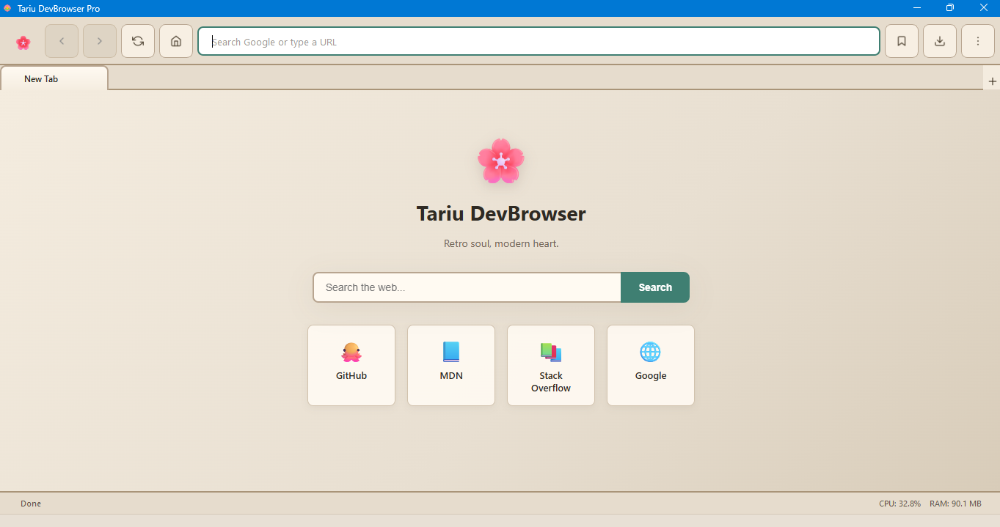

# 🌸 Tariu DevBrowser

  <strong>Retro soul, modern heart.</strong> 
  A Chromium-based developer browser with a warm, retro-modern design.

  <a href="#download">Download</a> •
  <a href="#features">Features</a> •
  <a href="#screenshots">Screenshots</a> •
  <a href="#keyboard-shortcuts">Shortcuts</a>

---

## ✨ Features

- 🏠 **Built-in Homepage** — Beautiful search page with quick links
- 📑 **Multi-Tab Browsing** — Chrome-style tabs with keyboard shortcuts
- ⭐ **Bookmarks & History** — Persistent, searchable, local storage
- 🛠 **DevTools Built-In** — Full Chrome DevTools (F12)
- 📥 **Download Manager** — Progress tracking for all downloads
- 🔍 **Find in Page** — Quick text search (Ctrl+F)
- 🎨 **Retro-Modern UI** — Warm beveled design with SVG icons
- 📊 **Live Telemetry** — Real-time CPU & RAM monitoring
- 🔒 **No Tracking** — Direct connections, no proxy

---

## 📥 Download

| Platform | Status | Download |
|----------|--------|----------|
| 🪟 Windows | ✅ Available | [Download](https://github.com/YOUR_USER/tariu-browser/releases/latest) |
| 🍎 macOS | 🔜 Coming Soon | — |
| 🐧 Linux | 🔜 Coming Soon | — |

---

## 📸 Screenshots

---

## ⌨️ Keyboard Shortcuts

| Shortcut | Action |
|----------|--------|
| Ctrl+T | New Tab |
| Ctrl+W | Close Tab |
| Ctrl+L | Focus URL Bar |
| Ctrl+D | Bookmark Page |
| Ctrl+F | Find in Page |
| Ctrl+H | History |
| Ctrl+B | Bookmarks |
| Ctrl+J | Downloads |
| Ctrl+Tab | Next Tab |
| Ctrl+Shift+Tab | Previous Tab |
| F5 / Ctrl+R | Reload |
| F11 | Fullscreen |
| F12 | DevTools |
| Alt+Left | Back |
| Alt+Right | Forward |

---

## 🐛 Report a Bug

Found a problem? [Open an issue](https://github.com/YOUR_USER/tariu-browser/issues/new?template=bug_report.md)

---

## 📝 License

This software is proprietary. All rights reserved. See [LICENSE](LICENSE).

---

Made with 🌸 by TariuSoftware

